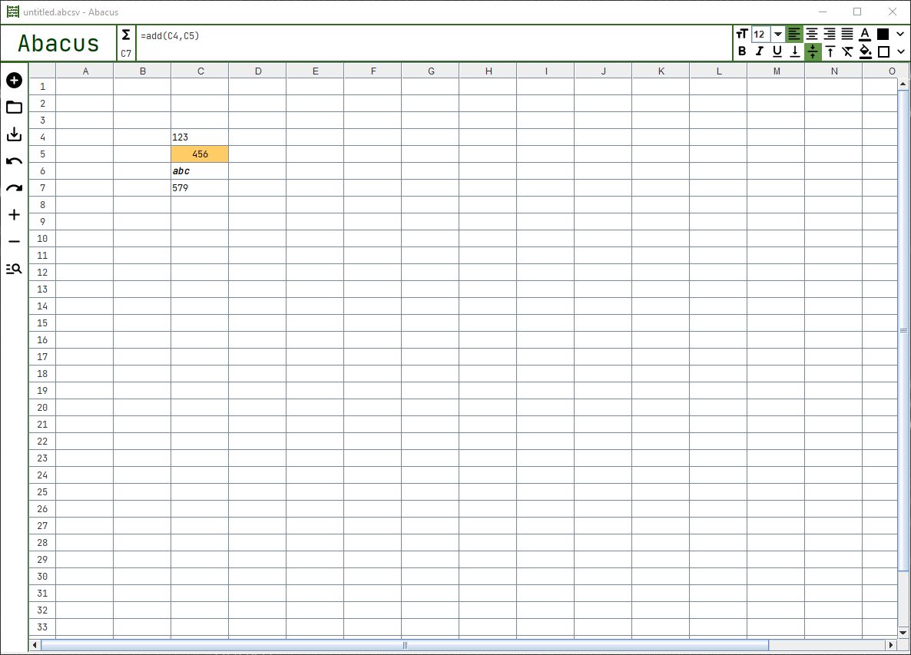

# abacus
## About
Table data editor with the support of formulas.



## Highlights
- graphical UI
- cells edition
- formulas with custom language
- endless scroll
- basic cell and text formatting

## Formula language
### Supported expressions
The language supports following expressions:
* number value, ie. `1`, `-12.34`
* text value, ie. `abc`
* logic value: `true` or `false`
* formulas, ie. `=add(1, 2)`

### Formulas syntax
Formulas start with `=` followed by formula name and arguments. Simple formula call looks as follows:
```
=add(1, 2) # 3
```

To use text value as argument wrap in with `''`:
```
=length('abc ') # 4
```

Other cell can be referenced with its address:
```
=add(1, B5) # 1 + value of B5
```

Formulas can take other formulas as arguments:
```
=abs(add(-10, length('abc'))) # 7
```

### Available formulas
#### Math
**Basic**:
* abs(number) -> number
* add(vararg number) -> number
* ceil(number) -> number
* div(number, number) -> number
* divide(vararg number) -> number
* floor(number) -> number
* mod(number, number) -> number
* multiply(vararg number) -> number
* subtract(vararg number) -> number

**Stats**:
* max(vararg number) -> number
* mean(vararg number) -> number
* min(vararg number) -> number
* std(vararg number) -> number

#### Text
* length(text) -> number
* lower(text) -> text
* sub(text, number, number) -> text
* upper(text) -> text

#### Logic
* compare(vararg any) -> logic
* if(logic, any, any) -> any

## Running it
> Note that the app was tested only on Windows.

Requirements:
- Java 15
- physical display

Steps:
1. Checkout the code
2. Type `./gradlew run`

## Possible enhancements
**Features:**
- cell range reference
- working side menu (ie. saving, undo/redo, search)
- syntax highlighting
- event based user behaviour metrics

**Technical:**
- split app into three modules
- integration tests
